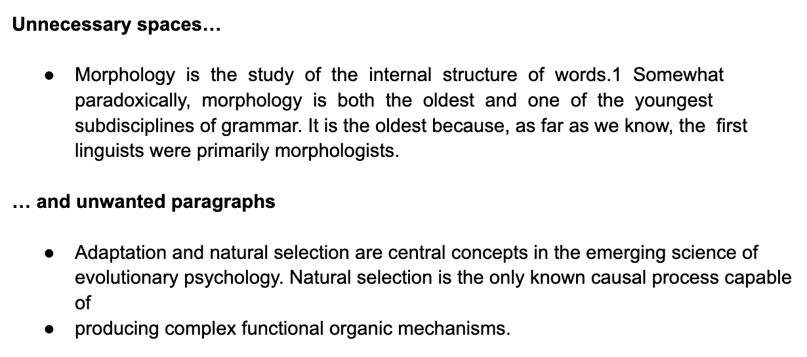

# COPYDF

A tool to format text easily when copy-pasting from PDFs.

# Motivation

I do quite a few readings for school. Sometimes, when I copy-paste text from those
readings into Google Docs, they go all wonky like this:

I got so fed up manually deleting those spaces and paragraphs one by one that I decided
to just make a web app that would do the formatting for me in much fewer clicks.
And if I was going to make a simple web app, I might as well use it as an opportunity
to try out some new technologies that I've been meaning to as well :)

# Technologies

React, Material UI

# Progress

- [ ] Dark mode
- [ ] Add option to correct hyphen spacing
  - e.g. ensure that _well-formed_ is pasted as _well-formed_, not _well- formed_
    or _well -formed_
  - Why an option, not a default?
    - I personally have use cases where I would not want the hyphen spacings
      "corrected", e.g. for linguistics readings where hyphens can denote affixes
      like _re-_ or _-ness_
- [ ] Add ML to detect and handle further spacing errors, e.g. "whenitcopieslikethis",
      "o r t h i s"
- [ ] Abstract out all components into separate folder (this is a small enough project
      that the ROI on doing so is quite low, but it's good practice!)
- [ ] Improve labels

These to-dos are noted in [App.js](src/App.js) as well.
